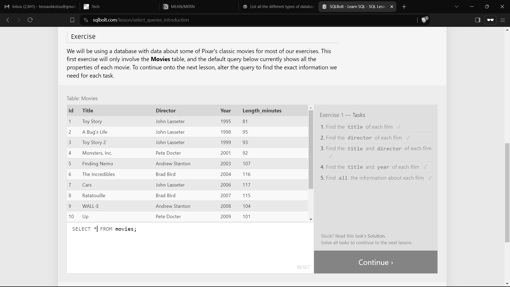
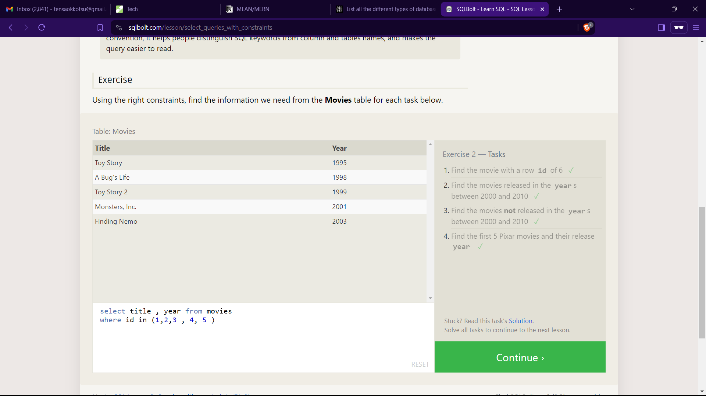
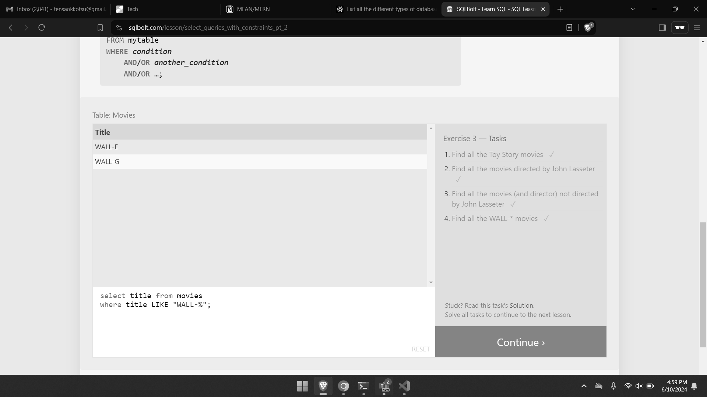
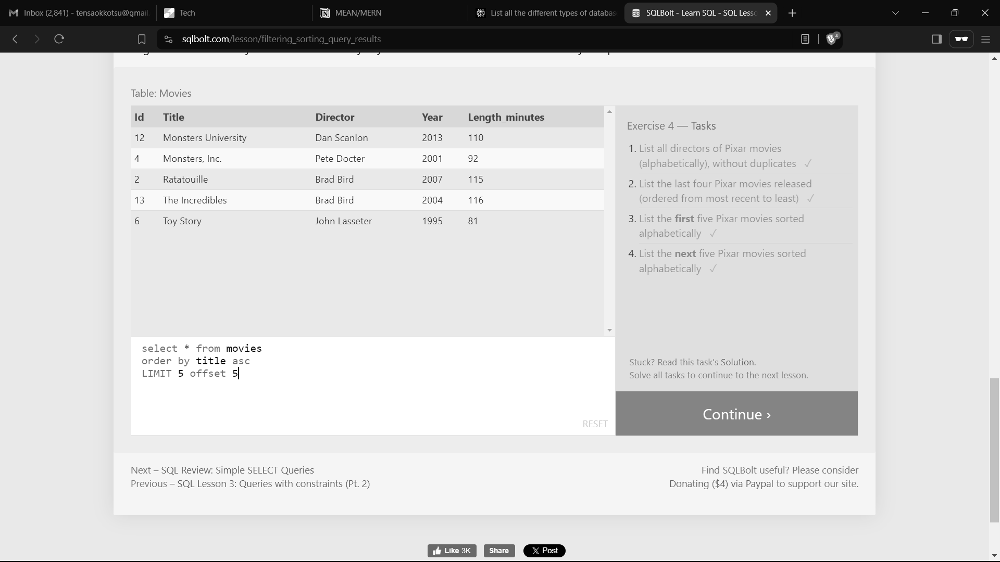
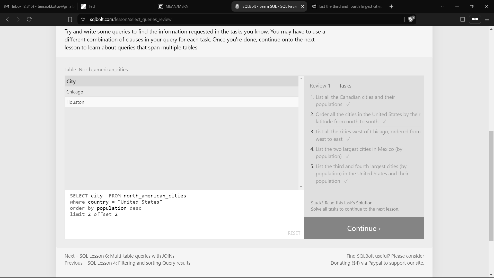

# SQL Lesson 1: SELECT Queries 101 

1. Find the title of each film 
2. Find the director of each film 
3. Find the title and director of each film 
4. Find the title and year of each film . 
5. Find all the information of the table . 

# Exercise 2 — Tasks
 1. Find the movie with a row id of 6 
 2. Find the movies released in the years between 2000 and 2010 
 3. Find the movies not released in the years between 2000 and 2010 
 4. Find the first 5 Pixar movies and their release year 

 

# Exercise 3 — Tasks
1. Find all the Toy Story movies 
2. Find all the movies directed by John Lasseter 
3. Find all the movies (and director) not directed by John  Lasseter 
4. Find all the WALL-* movies 

 

# Exercise 4 — Tasks
1. List all directors of Pixar movies (alphabetically), without duplicates
2. List the last four Pixar movies released (ordered from most recent to least)
3. List the first five Pixar movies sorted alphabetically
4. List the next five Pixar movies sorted alphabetically 

# Review 1 — Tasks
1. List all the Canadian cities and their populations
Order all the cities in the United States by their latitude from north to south
2. List all the cities west of Chicago, ordered from west to east
3. List the two largest cities in Mexico (by population)
4. List the third and fourth largest cities (by population) in the United States and their population

# Exercise 6 — Tasks
  1. Find the domestic and international sales for each movie
  2. Show the sales numbers for each movie that did better internationally rather than domestically
  3. List all the movies by their ratings in descending order 

 

# Exercise 7 — Tasks
  1. Find the list of all buildings that have employees 
  2. Find the list of all buildings and their capacity 
  3. List all buildings and the distinct employee roles in each building (including empty buildings) 

  

# Exercise 8 — Tasks
1. Find the name and role of all employees who have not been
assigned to a building ✓
2. Find the names of the buildings that hold no employees 

# Exercise 9 — Tasks
1. List all movies and their combined sales in millions of dollars ✓
2. List all movies and their ratings in percent ✓
3. List all movies that were released on even number years 

